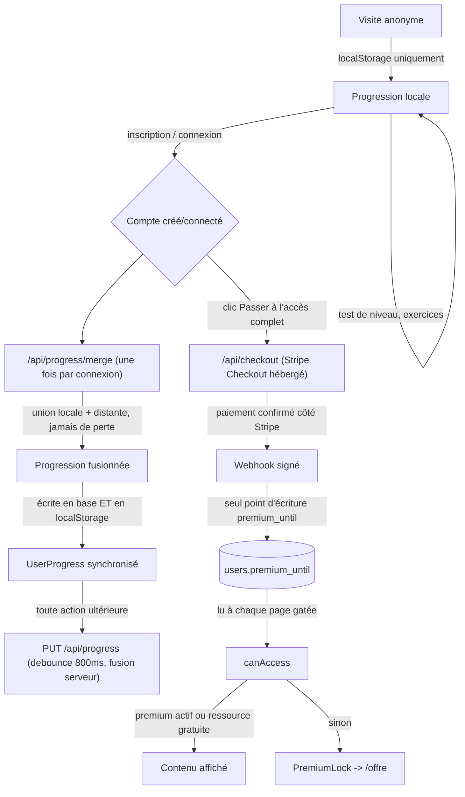

# Cycle de vie utilisateur

Cartographie du parcours complet, de la première visite anonyme jusqu'à
l'achat et au retour sur le site, avec pour chaque étape ce qui fait
réellement foi. Chantier distinct de l'audio, du contenu pédagogique et de la
qualité frontend — voir `docs/b1/audio-human-recording-plan.md`,
`docs/quality/frontend-production-audit.md`.

**Contraintes respectées** : aucun vrai paiement déclenché, aucune carte
réelle utilisée, aucune donnée utilisateur supprimée, aucun prix changé,
aucune configuration Stripe distante modifiée, rien poussé/déployé, aucun
secret révélé ou loggé.

---

## 1. Flux logique



## 2. Étapes et ce qui fait foi

| Étape | Composants/fichiers | Source de vérité |
|---|---|---|
| Progression anonyme | `lib/pedagogy/useProgress.ts` (`localStorage`) | Le navigateur uniquement — aucun compte requis, fonctionne hors ligne |
| Inscription / connexion | `app/actions/auth.ts`, `lib/auth/users.ts`, `lib/auth/session.ts` | Table `users` (mot de passe : `scrypt` + sel, jamais en clair) ; session = cookie `httpOnly` opaque, hash SHA-256 en base (`sessions.token_hash`) |
| Session | `lib/auth/session.ts`, `lib/auth/dal.ts` (`getCurrentUser`, mémoïsé par rendu) | Ligne `sessions` en base ; cookie absent/expiré/invalide → `null`, jamais d'exception |
| Fusion progression locale ↔ compte | `app/api/progress/merge/route.ts`, `mergeUserProgress` (`lib/pedagogy/logic/progress.ts`) | Union pure des deux côtés — voir §4 |
| Synchronisation continue | `app/api/progress/route.ts` (`PUT`) | Fusionne avec la base à chaque envoi (voir §4, corrigé dans ce chantier) — jamais un simple écrasement |
| Accès premium | `lib/commerce/access.ts` (`canAccess`) | `users.premium_until` (colonne DB), **jamais** lu depuis `localStorage` côté serveur ; écrit **uniquement** par le webhook Stripe |
| Paiement | `app/api/checkout/route.ts`, Stripe Checkout hébergé | Aucune donnée de carte ne transite par ce code |
| Confirmation d'accès premium | `app/api/webhooks/stripe/route.ts` | Signature Stripe vérifiée (`stripe.webhooks.constructEvent`) — jamais le corps de requête brut, jamais `/paiement/succes` |
| Réinitialisation mot de passe | `lib/auth/password-reset.ts` | Token à usage unique, hashé en base, consommé atomiquement (`UPDATE ... WHERE used_at IS NULL RETURNING`) |
| Suivi/révision (compétences faibles, modules à reprendre) | `app/(pedagogie)/progression/page.tsx` | Dérivé du même `UserProgress` que la progression — pas de sous-système séparé, suit donc automatiquement la même règle de fusion |

---

## 3. Session (Phase 2)

Vérifié par lecture de code (`lib/auth/session.ts`, `lib/auth/dal.ts`) :

- **Cookie absent** → `getSessionUserId()` retourne `null` immédiatement, pas de requête DB.
- **Cookie invalide** (hash ne correspond à aucune session) → `rows[0]` est `undefined` → `null`.
- **Cookie expiré** → détecté (`expires_at < now`), la session est supprimée en base à la volée puis `null` est retourné — pas de session zombie qui traîne.
- **Utilisateur supprimé** → `sessions.user_id REFERENCES users(id) ON DELETE CASCADE` (voir `schema.sql`) : supprimer un compte supprime automatiquement ses sessions, sa progression et ses tokens de réinitialisation. Pas de fonctionnalité de suppression de compte exposée aujourd'hui, mais l'intégrité référentielle est déjà correcte si elle est ajoutée plus tard.
- **Fallback anonyme** : `getCurrentUser()` retourne `AuthUser | null`, jamais d'exception — toutes les pages qui l'appellent (gating premium, `/offre`, `/paiement/succes`) gèrent `user === null` comme un visiteur normal, pas comme une erreur.

Aucun crash trouvé dans cette matrice.

---

## 4. Progression : anonyme, fusion, multi-appareil (Phases 5-7)

### Fusion à la connexion (déjà correcte, testée)

`mergeUserProgress` (`lib/pedagogy/logic/progress.ts`) fait une **union**, jamais un remplacement :
- exercices complétés/réussis par module : union d'ensembles (`Set`), aucun doublon possible ;
- `completed` d'un module : vrai si l'un des deux côtés le dit vrai, ou si l'union atteint le total ;
- tentatives d'examen : fusionnées par id, la plus avancée (`completed` > `in_progress` > `abandoned`) l'emporte ;
- `lastActivityAt` : le plus récent des deux.

Déclenchée une seule fois par connexion (garde-fou `mergedForUserId`), mais **idempotente** — la rappeler ne duplique jamais rien (testé : `lib/pedagogy/logic/progress.test.ts`).

### Bug corrigé dans ce chantier : niveau et date de positionnement désynchronisés

`level` et `placementCompletedAt` sont toujours écrits **ensemble** (`markPlacementCompleted`,
`useProgress.ts`) — un niveau n'a de sens qu'accompagné de la date du test qui l'a produit. Avant
correction, `mergeUserProgress` résolvait ces deux champs **indépendamment** (`level: local.level`
mais `placementCompletedAt: remote.placementCompletedAt ?? local.placementCompletedAt`) : un compte
ayant passé le test de positionnement sur un autre appareil pouvait se retrouver, après connexion sur
un nouvel appareil, avec la **date** du vrai test mais le **niveau par défaut** de l'appareil local
(jamais testé) — un niveau affiché qui ne correspond à aucun test réellement passé. Corrigé
(`resolvePlacement`) : niveau et date voyagent maintenant toujours ensemble, depuis le côté qui a le
test le plus récent. Testé (régression confirmée : le test échoue sur l'ancien code, restauré).

### Bug corrigé dans ce chantier : synchronisation multi-appareil

`PUT /api/progress` (synchronisation d'arrière-plan, debounce 800 ms) **remplaçait** intégralement la
progression stockée par celle envoyée. Deux appareils connectés au même compte en parallèle (ex.
téléphone + ordinateur) pouvaient donc s'écraser silencieusement l'un l'autre : le dernier `PUT` reçu
gagne, sans tenir compte de ce que l'autre appareil venait d'écrire entre-temps — perte de progression
possible sans aucune erreur visible. Corrigé : `PUT` fusionne désormais avec la progression déjà en
base (même fonction pure `mergeUserProgress` déjà utilisée et testée pour la connexion) avant
d'enregistrer — un envoi ne peut plus faire régresser ce qui est déjà stocké.

**Stratégie multi-appareil retenue** (déterministe, volontairement simple — pas de système distribué) :
- à la connexion sur un nouvel appareil : fusion complète avec le serveur ;
- pendant une session active : chaque synchronisation fusionne avec l'état serveur courant, donc
  aucune régression n'est possible, même si les appareils sont utilisés en parallèle ;
- **limite assumée** : un appareil resté ouvert plusieurs heures ne rapatrie pas automatiquement, en
  temps réel, ce qu'un autre appareil vient d'ajouter entre-temps (pas de WebSocket/pull périodique) —
  il faudra recharger la page (ou se reconnecter) pour voir apparaître ce que l'autre appareil a
  contribué. Ce n'est pas une perte de données (le serveur, lui, a bien tout), seulement un décalage
  d'affichage temporaire sur l'appareil resté inactif — jugé suffisant pour ce produit, une vraie
  synchronisation temps réel serait hors de proportion avec le besoin.

### Inscription après progression anonyme (scénario du chantier)

Testé par lecture de code + tests : un visiteur qui avance anonymement (localStorage uniquement) puis
crée un compte envoie sa progression locale à `/api/progress/merge` au moment de la connexion (voir
`useProgress.ts`, effet déclenché par le changement de `user`). Les 4 cas demandés :
- **local seulement** (compte neuf) : devient la progression du compte telle quelle ;
- **serveur seulement** (reconnexion sans rien de local) : la progression serveur est simplement renvoyée ;
- **les deux** : fusion par union (voir ci-dessus) ;
- **ni l'un ni l'autre** (compte neuf, jamais rien fait) : `EMPTY_USER_PROGRESS`, jamais les données de démo marketing (voir note ci-dessous).

**Point vérifié séparément** : le `progress` renvoyé par `useProgress()` avant toute interaction
affiche `INITIAL_USER_PROGRESS` (progression de démonstration avec des exercices déjà marqués
terminés, utilisée pour que la page `/progression` ne soit pas vide en vitrine) — mais ce n'est
**jamais** ce qui est envoyé à `/api/progress/merge` : `readRaw()` renvoie `""` tant que rien n'a été
réellement écrit, et `localRaw ? parseProgress(localRaw) : null` traite explicitement une chaîne vide
comme "rien à fusionner" (`null`), pas comme la démo. Un visiteur qui n'a jamais rien fait avant de
s'inscrire ne peut donc pas voir de fausses données de démo migrées vers son compte réel.

---

## 5. Accès premium (Phase 9)

`canAccess()` (`lib/commerce/access.ts`) est un pur calcul à partir de `premiumUntil`, une date ISO
qui **n'existe que côté serveur** (colonne `users.premium_until`, jamais dans `localStorage`). Les
pages qui gatent réellement du contenu (`ModulePage`, `ExamPage`, `/offre`) sont des **Server
Components** qui appellent `getCurrentUser()` (lecture DB via la session) puis `canAccess()` — un
utilisateur qui modifierait son `localStorage` ne changerait rien à ce que le serveur lui envoie :
`localStorage` ne contrôle que la progression pédagogique, jamais l'autorisation d'accès.

Testé (`lib/commerce/access.test.ts`) : anonyme, compte gratuit, premium actif, premium expiré (retombe
au niveau gratuit), module gratuit vs payant, examen (toujours payant — aucun n'est dans la liste des
ressources gratuites).

### ✅ Ancien risque résiduel — corrigé (voir § Premium content boundary ci-dessous)

Le chantier précédent avait identifié et documenté ici un risque élevé : `lib/pedagogy/data/modules.ts`
(contenu intégral, réponses comprises) était importé directement par 4 composants client, ce qui
l'incluait dans le bundle JavaScript envoyé à tout visiteur — vérifié concrètement dans le build de
l'époque. Ce risque a été traité par un chantier dédié (voir § Premium content boundary) : le contenu
protégé ne quitte plus jamais le serveur pour un module non autorisé. Conclusion de ce chantier :
`CONTENU PREMIUM PROTÉGÉ — CYCLE UTILISATEUR PRÊT`.

---

## Premium content boundary

Chantier dédié à la fuite décrite ci-dessus. Objectif : qu'un utilisateur non autorisé ne reçoive
**jamais** — HTML, RSC payload, JSON d'API, props React ou bundle JavaScript — le contenu pédagogique
protégé auquel il n'a pas droit. Le contrôle d'accès reste entièrement côté serveur ; le client n'est
jamais l'autorité.

### Origine exacte de la fuite (avant correction)

Deux mécanismes distincts, tous deux réels :

1. **Fuite bundle JavaScript** : `lib/pedagogy/logic/progress.ts` (le calcul de progression) importait
   `MODULES` (contenu intégral) pour construire les totaux d'exercices par compétence sur l'ensemble du
   programme. Ce fichier est importé par `lib/pedagogy/useProgress.ts` (`"use client"`), lui-même
   utilisé par la quasi-totalité des pages pédagogiques — la fuite touchait donc **toute** page
   affichant de la progression, pas seulement les 4 composants identifiés au départ. `PrimaryCta.tsx`,
   `parcours/page.tsx` et `progression/page.tsx` important `MODULES` directement en étaient des cas
   particuliers, pas la cause profonde.
2. **Fuite RSC payload**, plus sévère car exploitable sans même inspecter le JavaScript : `app/(pedagogie)/parcours/[stageSlug]/page.tsx`
   (Server Component) récupérait `getStageModules(stage, MODULES)` — **tous** les modules d'une étape,
   contenu complet inclus — et les passait en `prop` à `StageExperience.tsx` (`"use client"`), **sans
   aucune vérification `canAccess()`** à ce niveau. Next.js sérialise les props d'un composant client
   dans la réponse HTTP de la page : visiter `/parcours/poser-les-bases` livrait donc le contenu complet
   (réponses comprises) des modules premium de cette étape à **tout** visiteur, y compris anonyme —
   avant même d'ouvrir un outil de développement.

### Classification des données

**A. Publiques** (`PublicModule`, `lib/pedagogy/types.ts`) : id, slug, titre, description, objectifs,
niveau, domaine, étape (`stageId`), durée estimée, et pour chaque exercice — id, **type**, `skillId`,
difficulté. Le `skillId`/type sont nécessaires au calcul de progression par compétence et à
l'affichage ("1 exercice d'écoute") sans jamais exposer un énoncé ou une réponse.

**B. Protégées** (`Module`/`Exercise`, `lib/pedagogy/data/modules.ts`) : tout le reste — consignes,
textes, questions, choix, **réponses correctes** (`correctChoiceId`, `correctAnswer`...), corrections,
transcripts, `situation`, `vocabulary`, `languagePoints`.

### Architecture après correction

```
data/modules.ts (MODULES, contenu intégral)
  │  lu UNIQUEMENT par du code serveur :
  │  - ModulePage / ExamPage (déjà gatées par canAccess(), inchangé)
  │  - scripts/generate-public-modules.mjs (build-time)
  ▼
scripts/generate-public-modules.mjs
  │  dérive une fois, au build, la vue publique (aucun import possible
  │  vers data/modules.ts par du code client — voir § "pourquoi un fichier
  │  généré" ci-dessous)
  ▼
data/modules-public.generated.ts (PUBLIC_MODULES, aucune donnée protégée
  │  dans son code source — rien à retirer, rien à faire confiance à un
  │  tree-shaking)
  ▼
data/modules-public.ts (API stable : getPublicModuleBySlug, getPublicModulesByLevel)
  │
  ├─→ Server Components (StagePage, ParcoursPage, ProgressionPage) : import direct,
  │    passent PUBLIC_MODULES en prop à leurs composants "use client"
  │    (StageExperience, ParcoursExperience, ProgressionExperience)
  │
  └─→ GET /api/modules/public (route publique, sans auth requise — ce n'est pas
       une donnée par utilisateur) : consommée par PrimaryCta.tsx, seul composant
       client sans Server Component ancêtre dédié à qui faire porter le calcul
       (partagé par de nombreux en-têtes/pages)
```

**Pourquoi un fichier généré plutôt qu'une dérivation à l'exécution** (`PUBLIC_MODULES =
MODULES.map(...)`) : `lib/pedagogy/logic/progress.ts` a besoin de cette donnée **côté client**, de
façon synchrone (mise à jour de la progression pendant qu'un exercice est fait, sans aller-retour
réseau). Si la dérivation avait lieu dans un fichier importé côté client, le bundler devrait quand même
inclure la totalité de `modules.ts` dans le bundle navigateur pour pouvoir l'exécuter — ne ré-exporter
que le résultat allégé n'y change rien, un module ES est évalué en bloc. `scripts/generate-public-modules.mjs`
exécute cette dérivation une fois, en Node (jamais dans le navigateur), et écrit le résultat déjà réduit
dans `modules-public.generated.ts` — un fichier dont le code source ne contient tout simplement jamais
le contenu protégé, donc rien à retirer par tree-shaking et rien à faire confiance à son bon
fonctionnement. À relancer via `npm run generate:public-modules` après toute modification de
`data/modules.ts` ; `lib/pedagogy/data/modules-public.test.ts` échoue si le fichier généré n'est plus
synchronisé avec la source.

Deux fonctions pures ont aussi été déplacées de `data/modules.ts` vers `lib/pedagogy/logic/module-structure.ts`
(`findExerciseInModule`, `countModuleExercises`) : elles n'avaient besoin que du `Module` déjà reçu en
paramètre par leur appelant (jamais du catalogue global), mais leur emplacement précédent forçait quand
même quiconque les important à dépendre du fichier qui porte aussi `MODULES` — corrigé pour la même
raison que ci-dessus : ne jamais compter sur le tree-shaking pour une donnée de cette sensibilité.

### Comportement par profil

- **Anonyme / gratuit, module premium non autorisé** : titre, description et objectifs restent
  visibles (page verrouillée cohérente, `PremiumLock` avec CTA vers `/offre`) — mais aucun exercice,
  aucune réponse, aucun texte protégé n'atteint jamais le navigateur pour ce module. Vérifié en direct
  (réponse HTTP brute de `/parcours/poser-les-bases` interceptée et inspectée) : aucun champ protégé
  présent, y compris pour le module verrouillé listé sur la page.
- **Module gratuit** (`se-presenter`, `decrire-vie-quotidienne`) : fonctionne à l'identique
  d'avant ce chantier — contenu complet, exercices, correction, progression. `ModulePage` (Server
  Component) reste le seul point qui lit `data/modules.ts` pour la rendre, après un `canAccess()`
  qui autorise ces deux modules à tout le monde.
- **Premium** : accès complet inchangé, même mécanisme (`canAccess()` autorise, `ModuleExperience`
  reçoit le `Module` complet en prop depuis le Server Component déjà gaté). Aucun changement UX.
- **Révision / progression avec un module devenu inaccessible** : `getModuleCompletionRate`,
  `computeSkillProgress` et `mergeUserProgress` travaillent sur `PublicModule[]`/des ids — une
  référence de progression vers un `moduleId` qui n'existe plus dans `PUBLIC_MODULES` est simplement
  ignorée (`PUBLIC_MODULES.find(...)` renvoie `undefined`, déjà géré par un `continue`/`?? 0`) : jamais
  de crash, jamais de contenu livré, la progression pour ce module cesse juste de compter dans les
  totaux affichés.

### Audio et assets publics

Les fichiers audio (`public/audio/**`) ne sont **pas concernés par ce chantier** — voir
`docs/b1/audio-human-recording-plan.md` pour le pipeline dédié. Point de clarté important, cependant :
un fichier servi depuis `public/` est une **URL publique par construction** (Next.js ne peut pas la
protéger par une vérification `canAccess()`, contrairement à une page). Aujourd'hui, les 18 pistes sont
100 % synthétiques et déjà accessibles par leur URL directe, gratuit et premium confondus — retirer les
`<audio>` de l'interface pour un module premium n'empêche pas de deviner/requêter l'URL directement.
Ce n'est **pas une régression de ce chantier** (l'architecture audio n'a pas changé), mais une
limite à documenter clairement si l'offre venait un jour à vouloir garantir l'exclusivité des pistes
audio elles-mêmes : cela demanderait un service de diffusion signée/authentifiée (hors périmètre —
« ne pas construire une infrastructure de stockage privé énorme sans nécessité »), pas une simple
suppression du lecteur côté client.

### Garde-fous automatisés

- `lib/pedagogy/data/modules-public.test.ts` : `PUBLIC_MODULES` ne porte aucun champ protégé (à
  n'importe quelle profondeur), couvre exactement les mêmes modules que `MODULES`, et un test
  **statique** parcourt le graphe d'imports réel du dépôt pour vérifier qu'aucun fichier `"use client"`
  n'atteint `data/modules.ts` (ni son barrel `data/index.ts`), même transitivement — volontairement
  indépendant du comportement du bundler/tree-shaking. Testé positif : régression injectée
  (réintroduction d'un `import { MODULES }` dans `PrimaryCta.tsx`), le test échoue et remonte la chaîne
  complète (`error.tsx -> ... -> Header.tsx -> ... -> PrimaryCta.tsx`), puis restauré.
- `lib/pedagogy/logic/recommendation.test.ts` : `getNextModule`/`computeDailySession` produisent une
  recommandation correcte à partir des seules métadonnées publiques.
- Vérification empirique du build (au-delà des tests) : recherche de 5 phrases distinctives issues de
  5 modules premium différents dans `.next/static/` après `next build` — 0 résultat, alors que les
  mêmes phrases sont bien présentes dans `.next/server/` (le bundle SSR, qui ne quitte jamais le
  serveur). Reconfirmé en conditions réelles : réponse HTTP brute de `/parcours/poser-les-bases`
  interceptée en direct, aucun champ `correctChoiceId`/`correction` présent.

---

## 6. Stripe : checkout, webhook, idempotence (Phases 10-13)

### Checkout (`app/api/checkout/route.ts`)

- Paiement non configuré (`STRIPE_SECRET_KEY`/`STRIPE_PRICE_ID` absents) → `503`, jamais de faux succès.
- Utilisateur anonyme → `401` (le bouton `CheckoutButton` redirige alors vers `/connexion?next=/offre`).
- Utilisateur déjà premium → `409` (`already_premium`) — **empêche déjà un abonnement en doublon**,
  garde-fou serveur même si `/offre` masque déjà le bouton à un compte premium (défense en profondeur).
- `client_reference_id` + `metadata.userId` portent l'id interne, seul lien fiable entre la session
  Stripe et le compte.

### Cohérence offre/prix (Phase 10)

`lib/commerce/plans.ts` (`MAIN_PLAN`) est l'unique source du nom, prix affiché et fonctionnalités —
`components/marketing/Pricing.tsx`, `app/offre/page.tsx` et `app/cgv/page.tsx` le lisent tous les
trois, aucun prix codé en dur ailleurs. **Non vérifié** (hors périmètre, pas de contact Stripe réel) :
que `STRIPE_PRICE_ID` configuré côté environnement correspond bien à `MAIN_PLAN.priceLabel` — c'est une
saisie manuelle non synchronisée automatiquement, à vérifier par l'opérateur à chaque changement de prix.

### Webhook (`app/api/webhooks/stripe/route.ts`) — testé, `app/api/webhooks/stripe/route.test.ts`

- **Signature** : `stripe.webhooks.constructEvent` — requête sans en-tête ou signature invalide → `400`,
  rien n'est écrit en base.
- **Événement inconnu** : `default: break` → `200` (accuse réception, évite des retentatives Stripe
  inutiles) sans effet de bord.
- **Idempotence** : `checkout.session.completed` reçu deux fois (redélivrance Stripe, garantie
  "at-least-once") appelle `setUserPremium` deux fois avec **exactement la même valeur** — un `UPDATE`
  simple, pas un cumul : rejouer l'événement est sans risque, testé explicitement.
- **Référence manquante** (`client_reference_id`/`customer`/`subscription` absents) : log serveur,
  aucune écriture — jamais de crash sur un événement malformé.
- **Compte introuvable** (`customer.subscription.updated/deleted` pour un client Stripe non rattaché) :
  `break` silencieux, pas d'exception.

**Ordre inattendu — limite documentée, non corrigée** : chaque handler applique l'état de l'événement
reçu sans comparer à un horodatage ou re-vérifier l'état actuel auprès de Stripe. Si `customer.
subscription.updated` (renouvellement) et `customer.subscription.deleted` (résiliation immédiate)
arrivaient à l'envers de leur ordre chronologique réel (Stripe ne garantit pas un ordre strict en cas de
nouvelle tentative), le dernier traité gagnerait — un utilisateur qui vient de résilier pourrait se
retrouver avec le premium ranimé par un événement de renouvellement arrivé en retard. Scénario rare en
pratique (Stripe délivre en quasi temps réel et globalement dans l'ordre), non reproduit ni corrigé ici
— une mitigation robuste (re-vérifier l'état réel de l'abonnement auprès de l'API Stripe au moment du
traitement plutôt que de faire confiance au seul contenu de l'événement) est documentée comme piste
pour un futur chantier, plutôt qu'implémentée dans la précipitation.

### `/paiement/succes` (Phase 13) — déjà correct

Ne fait **jamais** confiance au paramètre d'URL `session_id` pour afficher un succès : la page relit
`getCurrentUser()` (donc `users.premium_until` réel) et affiche l'état réel du compte, avec un message
d'attente explicite si le webhook n'a pas encore été traité (quelques secondes en général). Rien à
corriger — déjà conforme à la consigne de ce chantier avant même son ouverture.

### `/paiement/annulation` (Phase 14) — déjà correct

Rassure explicitement ("Aucun montant n'a été débité"), propose de revoir l'offre ou de continuer
gratuitement. Rien à corriger.

---

## 7. Formulaires auth (Phase 3-4)

- **Inscription** : email/format validés, mot de passe ≥ 8 caractères, email déjà pris détecté (y
  compris en cas de course entre deux inscriptions concurrentes — contrainte `UNIQUE` en base + code
  d'erreur Postgres `23505` traduit en message identique, pas de fuite d'implémentation).
- **Connexion** : throttling par email (10 tentatives / 15 min, stocké en base — donc valable même sur
  des instances serverless différentes), message d'erreur volontairement identique pour "email inconnu"
  et "mauvais mot de passe" (pas d'énumération de comptes via ce formulaire).
- **Réinitialisation** : réponse **identique** que le compte existe ou non (pas d'énumération via ce
  formulaire non plus) ; token à usage unique, expirant (60 min), consommé de façon atomique
  (`UPDATE ... WHERE used_at IS NULL ... RETURNING`, protège contre une double soumission concurrente
  du même lien) ; changement de mot de passe → **toutes** les sessions actives du compte sont détruites
  (tous appareils), pas seulement celle qui a fait la demande. Origine du lien envoyé par email jamais
  dérivée du header `Host` de la requête en production (protection contre l'empoisonnement de lien de
  réinitialisation).

Rien de cassé trouvé dans ce périmètre — déjà robuste avant ce chantier.

---

## 8. Vie privée / API (Phases 19-20)

- `GET /api/auth/me` renvoie `{ id, email, premiumUntil }` — jamais le hash de mot de passe, jamais
  l'id client Stripe.
- `PUT/GET /api/progress` : l'id utilisateur vient toujours de la session serveur (`getCurrentUser()`),
  jamais d'un champ envoyé par le client — impossible d'écrire ou de lire la progression d'un autre
  compte via cette route (protection IDOR déjà en place).
- Toutes les routes API vérifient explicitement l'authentification et renvoient `401`
  (`unauthenticated`) plutôt qu'un comportement ambigu.

---

## 9. Tests ajoutés (Phase 21)

Priorité aux fonctions pures et aux mocks (pas de vraie base de données, pas de vrai Stripe) :

- `lib/pedagogy/logic/progress.test.ts` (10 tests) — fusion niveau/date (régression du bug corrigé),
  union des modules sans perte ni doublon, tentatives d'examen, idempotence.
- `lib/commerce/access.test.ts` (11 tests) — matrice anonyme/gratuit/premium/expiré × ressource
  gratuite/payante.
- `app/api/webhooks/stripe/route.test.ts` (10 tests, Stripe et `lib/auth/users` entièrement mockés) —
  signature, événement inconnu, idempotence (événement rejoué deux fois), référence manquante, compte
  introuvable.

Suite complète : 71 tests (40 avant ce chantier + 31 nouveaux), tous verts.

---

## 10. Risques résiduels (résumé)

| Risque | Sévérité | Statut |
|---|---|---|
| Contenu premium (réponses incluses) présent dans le bundle client via `MODULES` | Élevée | **Corrigé** (voir § Premium content boundary) — plus aucune donnée protégée hors du serveur pour un module non autorisé, vérifié par tests statiques + inspection du build + réponse HTTP réelle |
| URLs audio publiques (`public/audio/**`) : pas de protection possible par `canAccess()`, une URL directe reste accessible même pour une piste premium | Faible aujourd'hui (100 % synthétique) | Documenté, non corrigé — limite structurelle de `public/`, hors périmètre (voir § Premium content boundary) |
| Webhook Stripe : événements traités hors ordre chronologique réel | Faible (scénario rare) | Documenté, non corrigé (voir §6) |
| `STRIPE_PRICE_ID` distant non vérifié automatiquement contre `MAIN_PLAN.priceLabel` | Faible (erreur de saisie opérateur, pas un bug de code) | Documenté (voir §6) |
| Multi-appareil : décalage d'affichage temporaire sur un appareil resté inactif pendant qu'un autre progresse | Faible (pas de perte de données, juste un rafraîchissement à faire) | Assumé comme stratégie déterministe (voir §4) |
| Pas d'email de reprise/réengagement (inactivité) | Faible (produit fonctionne sans) | Décision documentée (voir §11) — infrastructure de préférences/consentement et de tâche planifiée absentes, non construites dans la précipitation |
| QA du cycle de vie non exercée en navigateur réel dans ce chantier | Faible (couverture par tests unitaires + lecture de code) | Aucune base de données/Stripe configurée dans cet environnement de travail (voir §11) |

---

## 11. Emails transactionnels et onboarding (chantier lifecycle)

Audit du cycle de vie complet (inscription, onboarding, récupération, paiement,
reprise, réengagement). Contraintes respectées : aucun email réel envoyé
pendant l'audit, aucune donnée inutile collectée, infrastructure email
existante réutilisée telle quelle (Resend, déjà en place pour la
réinitialisation de mot de passe — voir `lib/auth/mailer.ts`), cœur
pédagogique non touché.

### Inventaire des emails avant ce chantier

| Email | Déclencheur | Provider | État |
|---|---|---|---|
| Réinitialisation de mot de passe | `requestPasswordReset` (`app/actions/auth.ts`) | Resend | Prod si configuré, sinon lien journalisé en dev, échec explicite en prod non configuré |
| Reçu/facture Stripe | Paiement réussi | Stripe (natif, hors de ce code) | Géré entièrement par Stripe — volontairement non dupliqué |
| Bienvenue à l'inscription | — | — | **Absent avant ce chantier** |
| Reprise / réengagement | — | — | Absent (voir décision ci-dessous) |

### Gap identifié et corrigé : email de bienvenue absent

`signup()` créait le compte et la session sans aucune confirmation par email.
Ajouté `sendWelcomeEmail` (`lib/auth/mailer.ts`), même contrat que l'email de
réinitialisation existant (mêmes variables d'environnement `RESEND_API_KEY`/
`AUTH_EMAIL_FROM`, même canal de test en développement — lien/contenu
journalisé en console, jamais un vrai envoi hors production). Contenu :
confirmation de création de compte, rappel du niveau B1 visé, lien vers
`/parcours`, lien vers `/test-niveau` — **aucun CTA commercial/premium**
(testé explicitement, voir `lib/auth/mailer.test.ts`).

Appelé depuis `signup()` **après** la création du compte et de la session,
dans son propre `try/catch` : un échec Resend (mauvaise config, panne
provider) est journalisé (`logServerError("auth.welcome_email", ...)`) mais
ne fait **jamais** échouer l'inscription — l'utilisateur garde son compte et
sa session même si l'email ne part pas.

### Décision : pas d'email de reprise/réengagement dans ce chantier

Le schéma (`lib/auth/schema.sql`) ne porte aujourd'hui aucune colonne de
préférence email ni de distinction transactionnel/marketing, et il n'existe
aucun mécanisme de désinscription. Construire un email de reprise
("inactif depuis X jours") nécessiterait une tâche planifiée (aucune
infrastructure de cron existante dans ce projet) et un consentement explicite
préalable — ni l'un ni l'autre n'existe. Conformément à la consigne du
chantier ("ne l'ajoute que si l'infrastructure et le consentement le
permettent"), cet email n'a **pas** été ajouté plutôt que de construire dans
la précipitation une infrastructure de préférences/consentement hors de
proportion avec le reste du produit. Piste documentée pour un futur chantier
dédié, pas implémentée ici.

### Consentement / préférences (Phase 8 de l'audit)

Aucun email marketing n'existe dans ce projet (seulement transactionnel :
bienvenue, réinitialisation) — la distinction transactionnel/marketing et le
consentement RGPD associé sont donc sans objet aujourd'hui. Rien à corriger ;
à réévaluer si un email non transactionnel est ajouté un jour (voir décision
ci-dessus).

### Observabilité (Phase 10 de l'audit)

`requestPasswordReset` utilisait un `console.error` brut au lieu de
`logServerError` (seule fonction qui garantit qu'aucune clé sensible —
`email` y compris — n'atteint un log, voir `lib/observability/log.ts`) —
harmonisé. Le token de réinitialisation n'a jamais transité dans un log en
dehors du canal de test explicite (dev, provider non configuré) ; l'email de
bienvenue ne porte aucun secret.

### Tests ajoutés (Phase 11 de l'audit)

`lib/auth/mailer.test.ts` (9 tests, SDK Resend mocké, aucun vrai envoi) —
absent avant ce chantier alors que ce fichier gère déjà un email de
production (réinitialisation). Couvre pour les deux emails (bienvenue,
réinitialisation) : canal de test en dev (aucun envoi réel), échec explicite
en production si non configuré, appel effectif à Resend avec les bons
destinataire/liens en configuration valide, propagation d'une erreur du
provider plutôt que masquée, et l'absence de CTA commercial dans l'email de
bienvenue.

### QA (Phase 12 de l'audit)

Aucune base de données ni clé Stripe n'est configurée dans cet environnement
de travail (`.env.local` absent, `git worktree` isolé) — signup/login/reset/
checkout n'ont donc pas pu être exercés dans un navigateur réel pendant ce
chantier. Vérification faite par lecture de code + tests unitaires
uniquement pour la partie modifiée ; le reste du cycle (session, fusion de
progression, accès premium, webhook Stripe) était déjà couvert par les
chantiers précédents (voir §1-9 ci-dessus) et n'a pas été retesté en
conditions réelles ici.
