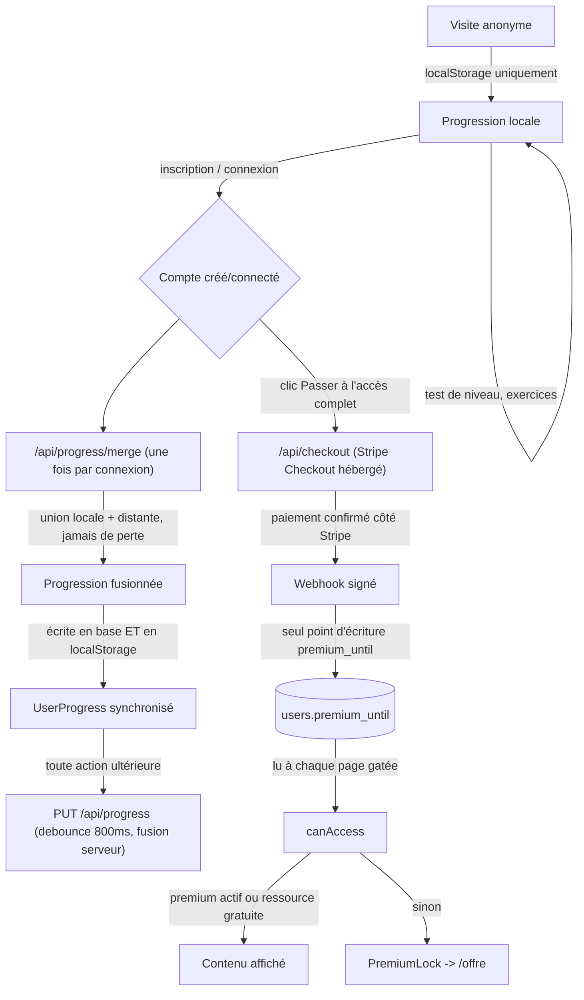

# Cycle de vie utilisateur

Cartographie du parcours complet, de la première visite anonyme jusqu'à
l'achat et au retour sur le site, avec pour chaque étape ce qui fait
réellement foi. Chantier distinct de l'audio, du contenu pédagogique et de la
qualité frontend — voir `docs/b1/audio-human-recording-plan.md`,
`docs/quality/frontend-production-audit.md`.

**Contraintes respectées** : aucun vrai paiement déclenché, aucune carte
réelle utilisée, aucune donnée utilisateur supprimée, aucun prix changé,
aucune configuration Stripe distante modifiée, rien poussé/déployé, aucun
secret révélé ou loggé.

---

## 1. Flux logique

## 2. Étapes et ce qui fait foi

| Étape | Composants/fichiers | Source de vérité |
|---|---|---|
| Progression anonyme | `lib/pedagogy/useProgress.ts` (`localStorage`) | Le navigateur uniquement — aucun compte requis, fonctionne hors ligne |
| Inscription / connexion | `app/actions/auth.ts`, `lib/auth/users.ts`, `lib/auth/session.ts` | Table `users` (mot de passe : `scrypt` + sel, jamais en clair) ; session = cookie `httpOnly` opaque, hash SHA-256 en base (`sessions.token_hash`) |
| Session | `lib/auth/session.ts`, `lib/auth/dal.ts` (`getCurrentUser`, mémoïsé par rendu) | Ligne `sessions` en base ; cookie absent/expiré/invalide → `null`, jamais d'exception |
| Fusion progression locale ↔ compte | `app/api/progress/merge/route.ts`, `mergeUserProgress` (`lib/pedagogy/logic/progress.ts`) | Union pure des deux côtés — voir §4 |
| Synchronisation continue | `app/api/progress/route.ts` (`PUT`) | Fusionne avec la base à chaque envoi (voir §4, corrigé dans ce chantier) — jamais un simple écrasement |
| Accès premium | `lib/commerce/access.ts` (`canAccess`) | `users.premium_until` (colonne DB), **jamais** lu depuis `localStorage` côté serveur ; écrit **uniquement** par le webhook Stripe |
| Paiement | `app/api/checkout/route.ts`, Stripe Checkout hébergé | Aucune donnée de carte ne transite par ce code |
| Confirmation d'accès premium | `app/api/webhooks/stripe/route.ts` | Signature Stripe vérifiée (`stripe.webhooks.constructEvent`) — jamais le corps de requête brut, jamais `/paiement/succes` |
| Réinitialisation mot de passe | `lib/auth/password-reset.ts` | Token à usage unique, hashé en base, consommé atomiquement (`UPDATE ... WHERE used_at IS NULL RETURNING`) |
| Suivi/révision (compétences faibles, modules à reprendre) | `app/(pedagogie)/progression/page.tsx` | Dérivé du même `UserProgress` que la progression — pas de sous-système séparé, suit donc automatiquement la même règle de fusion |

---

## 3. Session (Phase 2)

Vérifié par lecture de code (`lib/auth/session.ts`, `lib/auth/dal.ts`) :

- **Cookie absent** → `getSessionUserId()` retourne `null` immédiatement, pas de requête DB.
- **Cookie invalide** (hash ne correspond à aucune session) → `rows[0]` est `undefined` → `null`.
- **Cookie expiré** → détecté (`expires_at < now`), la session est supprimée en base à la volée puis `null` est retourné — pas de session zombie qui traîne.
- **Utilisateur supprimé** → `sessions.user_id REFERENCES users(id) ON DELETE CASCADE` (voir `schema.sql`) : supprimer un compte supprime automatiquement ses sessions, sa progression et ses tokens de réinitialisation. Pas de fonctionnalité de suppression de compte exposée aujourd'hui, mais l'intégrité référentielle est déjà correcte si elle est ajoutée plus tard.
- **Fallback anonyme** : `getCurrentUser()` retourne `AuthUser | null`, jamais d'exception — toutes les pages qui l'appellent (gating premium, `/offre`, `/paiement/succes`) gèrent `user === null` comme un visiteur normal, pas comme une erreur.

Aucun crash trouvé dans cette matrice.

---

## 4. Progression : anonyme, fusion, multi-appareil (Phases 5-7)

### Fusion à la connexion (déjà correcte, testée)

`mergeUserProgress` (`lib/pedagogy/logic/progress.ts`) fait une **union**, jamais un remplacement :
- exercices complétés/réussis par module : union d'ensembles (`Set`), aucun doublon possible ;
- `completed` d'un module : vrai si l'un des deux côtés le dit vrai, ou si l'union atteint le total ;
- tentatives d'examen : fusionnées par id, la plus avancée (`completed` > `in_progress` > `abandoned`) l'emporte ;
- `lastActivityAt` : le plus récent des deux.

Déclenchée une seule fois par connexion (garde-fou `mergedForUserId`), mais **idempotente** — la rappeler ne duplique jamais rien (testé : `lib/pedagogy/logic/progress.test.ts`).

### Bug corrigé dans ce chantier : niveau et date de positionnement désynchronisés

`level` et `placementCompletedAt` sont toujours écrits **ensemble** (`markPlacementCompleted`,
`useProgress.ts`) — un niveau n'a de sens qu'accompagné de la date du test qui l'a produit. Avant
correction, `mergeUserProgress` résolvait ces deux champs **indépendamment** (`level: local.level`
mais `placementCompletedAt: remote.placementCompletedAt ?? local.placementCompletedAt`) : un compte
ayant passé le test de positionnement sur un autre appareil pouvait se retrouver, après connexion sur
un nouvel appareil, avec la **date** du vrai test mais le **niveau par défaut** de l'appareil local
(jamais testé) — un niveau affiché qui ne correspond à aucun test réellement passé. Corrigé
(`resolvePlacement`) : niveau et date voyagent maintenant toujours ensemble, depuis le côté qui a le
test le plus récent. Testé (régression confirmée : le test échoue sur l'ancien code, restauré).

### Bug corrigé dans ce chantier : synchronisation multi-appareil

`PUT /api/progress` (synchronisation d'arrière-plan, debounce 800 ms) **remplaçait** intégralement la
progression stockée par celle envoyée. Deux appareils connectés au même compte en parallèle (ex.
téléphone + ordinateur) pouvaient donc s'écraser silencieusement l'un l'autre : le dernier `PUT` reçu
gagne, sans tenir compte de ce que l'autre appareil venait d'écrire entre-temps — perte de progression
possible sans aucune erreur visible. Corrigé : `PUT` fusionne désormais avec la progression déjà en
base (même fonction pure `mergeUserProgress` déjà utilisée et testée pour la connexion) avant
d'enregistrer — un envoi ne peut plus faire régresser ce qui est déjà stocké.

**Stratégie multi-appareil retenue** (déterministe, volontairement simple — pas de système distribué) :
- à la connexion sur un nouvel appareil : fusion complète avec le serveur ;
- pendant une session active : chaque synchronisation fusionne avec l'état serveur courant, donc
  aucune régression n'est possible, même si les appareils sont utilisés en parallèle ;
- **limite assumée** : un appareil resté ouvert plusieurs heures ne rapatrie pas automatiquement, en
  temps réel, ce qu'un autre appareil vient d'ajouter entre-temps (pas de WebSocket/pull périodique) —
  il faudra recharger la page (ou se reconnecter) pour voir apparaître ce que l'autre appareil a
  contribué. Ce n'est pas une perte de données (le serveur, lui, a bien tout), seulement un décalage
  d'affichage temporaire sur l'appareil resté inactif — jugé suffisant pour ce produit, une vraie
  synchronisation temps réel serait hors de proportion avec le besoin.

### Inscription après progression anonyme (scénario du chantier)

Testé par lecture de code + tests : un visiteur qui avance anonymement (localStorage uniquement) puis
crée un compte envoie sa progression locale à `/api/progress/merge` au moment de la connexion (voir
`useProgress.ts`, effet déclenché par le changement de `user`). Les 4 cas demandés :
- **local seulement** (compte neuf) : devient la progression du compte telle quelle ;
- **serveur seulement** (reconnexion sans rien de local) : la progression serveur est simplement renvoyée ;
- **les deux** : fusion par union (voir ci-dessus) ;
- **ni l'un ni l'autre** (compte neuf, jamais rien fait) : `EMPTY_USER_PROGRESS`, jamais les données de démo marketing (voir note ci-dessous).

**Point vérifié séparément** : le `progress` renvoyé par `useProgress()` avant toute interaction
affiche `INITIAL_USER_PROGRESS` (progression de démonstration avec des exercices déjà marqués
terminés, utilisée pour que la page `/progression` ne soit pas vide en vitrine) — mais ce n'est
**jamais** ce qui est envoyé à `/api/progress/merge` : `readRaw()` renvoie `""` tant que rien n'a été
réellement écrit, et `localRaw ? parseProgress(localRaw) : null` traite explicitement une chaîne vide
comme "rien à fusionner" (`null`), pas comme la démo. Un visiteur qui n'a jamais rien fait avant de
s'inscrire ne peut donc pas voir de fausses données de démo migrées vers son compte réel.

---

## 5. Accès premium (Phase 9)

`canAccess()` (`lib/commerce/access.ts`) est un pur calcul à partir de `premiumUntil`, une date ISO
qui **n'existe que côté serveur** (colonne `users.premium_until`, jamais dans `localStorage`). Les
pages qui gatent réellement du contenu (`ModulePage`, `ExamPage`, `/offre`) sont des **Server
Components** qui appellent `getCurrentUser()` (lecture DB via la session) puis `canAccess()` — un
utilisateur qui modifierait son `localStorage` ne changerait rien à ce que le serveur lui envoie :
`localStorage` ne contrôle que la progression pédagogique, jamais l'autorisation d'accès.

Testé (`lib/commerce/access.test.ts`) : anonyme, compte gratuit, premium actif, premium expiré (retombe
au niveau gratuit), module gratuit vs payant, examen (toujours payant — aucun n'est dans la liste des
ressources gratuites).

### ⚠️ Risque résiduel identifié — non corrigé dans ce chantier

`lib/pedagogy/data/modules.ts` exporte un unique tableau `MODULES` contenant l'intégralité du contenu
pédagogique de **tous** les modules — textes, questions, **et réponses correctes** — qu'ils soient
gratuits ou payants. Ce tableau est importé **directement** par 4 composants client
(`app/(pedagogie)/parcours/page.tsx`, `.../progression/page.tsx`, `ModuleExperience.tsx`,
`PrimaryCta.tsx`), ce qui l'inclut dans le bundle JavaScript envoyé au navigateur de **tout**
visiteur, y compris anonyme, pour calculer localement la progression et le prochain module recommandé.

**Vérifié concrètement** (pas une hypothèse) : après `next build`, le chunk client
`.next/static/chunks/0tvm4tn0895f-.js` contient bien le texte intégral et les champs
`correctChoiceId` des modules — y compris ceux réservés à l'offre payante. N'importe qui peut lire les
réponses de tous les modules premium en ouvrant ce fichier statique, **sans avoir besoin de contourner
`canAccess()`** : le blocage empêche seulement l'affichage normal de l'exercice dans l'interface, pas
la présence du contenu dans le bundle.

Par contraste, `EXAMS` (l'examen blanc DELF, entièrement payant) **n'a pas** ce problème : aucun
composant client ne l'importe directement, il n'est reçu qu'en `prop` depuis le Server Component déjà
gaté par `canAccess()`.

**Pourquoi non corrigé ici** : une correction propre demande de scinder `Module` en une forme
"métadonnées" (id, slug, titre, domaine, étape — nécessaire aux 4 usages client actuels) et une forme
"contenu complet" (texte, questions, réponses — à ne jamais laisser atteindre un composant client pour
un module non débloqué), puis de migrer les 4 points d'import et de vérifier qu'aucun autre chemin ne
réintroduit la fuite. C'est un changement de modèle de données qui touche le cœur de
`lib/pedagogy/types.ts` et plusieurs fichiers de logique — davantage une réécriture ciblée qu'un
durcissement, risquée à faire dans la précipitation au milieu d'un audit plus large. **Recommandation** :
un chantier dédié, avec son propre plan de test, avant de considérer ce risque clos.

---

## 6. Stripe : checkout, webhook, idempotence (Phases 10-13)

### Checkout (`app/api/checkout/route.ts`)

- Paiement non configuré (`STRIPE_SECRET_KEY`/`STRIPE_PRICE_ID` absents) → `503`, jamais de faux succès.
- Utilisateur anonyme → `401` (le bouton `CheckoutButton` redirige alors vers `/connexion?next=/offre`).
- Utilisateur déjà premium → `409` (`already_premium`) — **empêche déjà un abonnement en doublon**,
  garde-fou serveur même si `/offre` masque déjà le bouton à un compte premium (défense en profondeur).
- `client_reference_id` + `metadata.userId` portent l'id interne, seul lien fiable entre la session
  Stripe et le compte.

### Cohérence offre/prix (Phase 10)

`lib/commerce/plans.ts` (`MAIN_PLAN`) est l'unique source du nom, prix affiché et fonctionnalités —
`components/marketing/Pricing.tsx`, `app/offre/page.tsx` et `app/cgv/page.tsx` le lisent tous les
trois, aucun prix codé en dur ailleurs. **Non vérifié** (hors périmètre, pas de contact Stripe réel) :
que `STRIPE_PRICE_ID` configuré côté environnement correspond bien à `MAIN_PLAN.priceLabel` — c'est une
saisie manuelle non synchronisée automatiquement, à vérifier par l'opérateur à chaque changement de prix.

### Webhook (`app/api/webhooks/stripe/route.ts`) — testé, `app/api/webhooks/stripe/route.test.ts`

- **Signature** : `stripe.webhooks.constructEvent` — requête sans en-tête ou signature invalide → `400`,
  rien n'est écrit en base.
- **Événement inconnu** : `default: break` → `200` (accuse réception, évite des retentatives Stripe
  inutiles) sans effet de bord.
- **Idempotence** : `checkout.session.completed` reçu deux fois (redélivrance Stripe, garantie
  "at-least-once") appelle `setUserPremium` deux fois avec **exactement la même valeur** — un `UPDATE`
  simple, pas un cumul : rejouer l'événement est sans risque, testé explicitement.
- **Référence manquante** (`client_reference_id`/`customer`/`subscription` absents) : log serveur,
  aucune écriture — jamais de crash sur un événement malformé.
- **Compte introuvable** (`customer.subscription.updated/deleted` pour un client Stripe non rattaché) :
  `break` silencieux, pas d'exception.

**Ordre inattendu — limite documentée, non corrigée** : chaque handler applique l'état de l'événement
reçu sans comparer à un horodatage ou re-vérifier l'état actuel auprès de Stripe. Si `customer.
subscription.updated` (renouvellement) et `customer.subscription.deleted` (résiliation immédiate)
arrivaient à l'envers de leur ordre chronologique réel (Stripe ne garantit pas un ordre strict en cas de
nouvelle tentative), le dernier traité gagnerait — un utilisateur qui vient de résilier pourrait se
retrouver avec le premium ranimé par un événement de renouvellement arrivé en retard. Scénario rare en
pratique (Stripe délivre en quasi temps réel et globalement dans l'ordre), non reproduit ni corrigé ici
— une mitigation robuste (re-vérifier l'état réel de l'abonnement auprès de l'API Stripe au moment du
traitement plutôt que de faire confiance au seul contenu de l'événement) est documentée comme piste
pour un futur chantier, plutôt qu'implémentée dans la précipitation.

### `/paiement/succes` (Phase 13) — déjà correct

Ne fait **jamais** confiance au paramètre d'URL `session_id` pour afficher un succès : la page relit
`getCurrentUser()` (donc `users.premium_until` réel) et affiche l'état réel du compte, avec un message
d'attente explicite si le webhook n'a pas encore été traité (quelques secondes en général). Rien à
corriger — déjà conforme à la consigne de ce chantier avant même son ouverture.

### `/paiement/annulation` (Phase 14) — déjà correct

Rassure explicitement ("Aucun montant n'a été débité"), propose de revoir l'offre ou de continuer
gratuitement. Rien à corriger.

---

## 7. Formulaires auth (Phase 3-4)

- **Inscription** : email/format validés, mot de passe ≥ 8 caractères, email déjà pris détecté (y
  compris en cas de course entre deux inscriptions concurrentes — contrainte `UNIQUE` en base + code
  d'erreur Postgres `23505` traduit en message identique, pas de fuite d'implémentation).
- **Connexion** : throttling par email (10 tentatives / 15 min, stocké en base — donc valable même sur
  des instances serverless différentes), message d'erreur volontairement identique pour "email inconnu"
  et "mauvais mot de passe" (pas d'énumération de comptes via ce formulaire).
- **Réinitialisation** : réponse **identique** que le compte existe ou non (pas d'énumération via ce
  formulaire non plus) ; token à usage unique, expirant (60 min), consommé de façon atomique
  (`UPDATE ... WHERE used_at IS NULL ... RETURNING`, protège contre une double soumission concurrente
  du même lien) ; changement de mot de passe → **toutes** les sessions actives du compte sont détruites
  (tous appareils), pas seulement celle qui a fait la demande. Origine du lien envoyé par email jamais
  dérivée du header `Host` de la requête en production (protection contre l'empoisonnement de lien de
  réinitialisation).

Rien de cassé trouvé dans ce périmètre — déjà robuste avant ce chantier.

---

## 8. Vie privée / API (Phases 19-20)

- `GET /api/auth/me` renvoie `{ id, email, premiumUntil }` — jamais le hash de mot de passe, jamais
  l'id client Stripe.
- `PUT/GET /api/progress` : l'id utilisateur vient toujours de la session serveur (`getCurrentUser()`),
  jamais d'un champ envoyé par le client — impossible d'écrire ou de lire la progression d'un autre
  compte via cette route (protection IDOR déjà en place).
- Toutes les routes API vérifient explicitement l'authentification et renvoient `401`
  (`unauthenticated`) plutôt qu'un comportement ambigu.

---

## 9. Tests ajoutés (Phase 21)

Priorité aux fonctions pures et aux mocks (pas de vraie base de données, pas de vrai Stripe) :

- `lib/pedagogy/logic/progress.test.ts` (10 tests) — fusion niveau/date (régression du bug corrigé),
  union des modules sans perte ni doublon, tentatives d'examen, idempotence.
- `lib/commerce/access.test.ts` (11 tests) — matrice anonyme/gratuit/premium/expiré × ressource
  gratuite/payante.
- `app/api/webhooks/stripe/route.test.ts` (10 tests, Stripe et `lib/auth/users` entièrement mockés) —
  signature, événement inconnu, idempotence (événement rejoué deux fois), référence manquante, compte
  introuvable.

Suite complète : 71 tests (40 avant ce chantier + 31 nouveaux), tous verts.

---

## 10. Risques résiduels (résumé)

| Risque | Sévérité | Statut |
|---|---|---|
| Contenu premium (réponses incluses) présent dans le bundle client via `MODULES` | **Élevée** — contourne le paywall sans même avoir besoin de manipuler `localStorage` | Documenté, non corrigé (voir §5) — nécessite un chantier dédié de scission des données |
| Webhook Stripe : événements traités hors ordre chronologique réel | Faible (scénario rare) | Documenté, non corrigé (voir §6) |
| `STRIPE_PRICE_ID` distant non vérifié automatiquement contre `MAIN_PLAN.priceLabel` | Faible (erreur de saisie opérateur, pas un bug de code) | Documenté (voir §6) |
| Multi-appareil : décalage d'affichage temporaire sur un appareil resté inactif pendant qu'un autre progresse | Faible (pas de perte de données, juste un rafraîchissement à faire) | Assumé comme stratégie déterministe (voir §4) |
